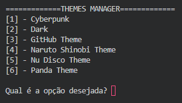
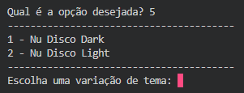

# 🎨 ThemeManager

Um gerenciador de temas para o Visual Studio Code desenvolvido em Python.

## 📖 Sobre o projeto

O **ThemeManager** é um projeto criado com o objetivo de automatizar a troca de temas do Visual Studio Code de forma simples e organizada.

A ideia surgiu durante meus estudos de Python, quando percebi que poderia transformar um processo manual — alterar o tema diretamente nas configurações do VS Code — em uma aplicação capaz de realizar essa tarefa automaticamente.

Além de resolver esse problema, o projeto foi desenvolvido para colocar em prática conceitos fundamentais de programação, como modularização, manipulação de arquivos JSON, funções, validação de dados e organização de projetos.

Esta é a **versão 1.0** do ThemeManager, desenvolvida inteiramente em Python utilizando interface via terminal.

---

## ✨ Funcionalidades

* Seleção de temas pelo terminal.
* Seleção de variações de cada tema pelo terminal.
* Validação das entradas do usuário.
* Alteração automática do tema do Visual Studio Code.
* Atualização do arquivo `config.json`.
* Código organizado em módulos para facilitar a manutenção.

---

## 🛠️ Tecnologias utilizadas

* Python
* JSON
* Visual Studio Code

---

## 📁 Estrutura do projeto

```text
ThemeManager
│
├── dados
├── docs
├── interface
├── json
├── settings
│
├── main.py
└── README.md
```

---

## 🚀 Como executar

1. Clone este repositório.

2. Acesse a pasta do projeto.

3. Execute:

```bash
python main.py
```

4. Escolha um tema no terminal.

5. Escolha a variação desejada.

6. O ThemeManager aplicará automaticamente a configuração e salvará as alterações.

---

## 📸 Demonstração
#### Menu de Temas

---
Menu de Variação de Temas

---

## 📚 O que aprendi durante o desenvolvimento do ThemeManager

Este projeto foi fundamental para consolidar e desenvolver conhecimentos em:

* Organização de projetos em múltiplos módulos.
* Criação e utilização de funções.
* Passagem de parâmetros e retorno de valores.
* Manipulação de arquivos JSON.
* Leitura e escrita de arquivos.
* Validação de entradas do usuário.
* Estruturação de projetos em Python.
* Utilização de Git e GitHub para controle de versão.

Além dos aspectos técnicos, o desenvolvimento do ThemeManager também me ajudou a compreender melhor a importância de planejar o fluxo de um sistema antes da implementação, utilizando fluxogramas e diagramas para planejar e organizar cada responsabilidade em arquivos separados.

---

## 🎯 Próximos passos

A versão 1.0 representa a base do projeto. Entre as melhorias planejadas para as próximas versões estão:

* Detectar automaticamente os temas instalados no Visual Studio Code.
* Tornar a seleção de temas mais dinâmica.
* Melhorar a experiência do usuário.
* Refatorar partes do código conforme novos conhecimentos forem adquiridos.
* Adicionar novas funcionalidades para tornar o gerenciamento de temas mais completo.

---

## 👩‍💻 Autor

Desenvolvido por **Clara Bueno** como projeto de estudos em Python.

Estou utilizando este projeto para praticar boas práticas de programação, organização de código e desenvolvimento de software, registrando minha evolução ao longo da jornada na área de tecnologia.
